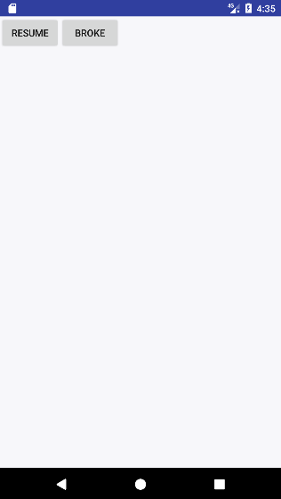

# ParticleBroken
## 一个粒子破碎的效果，对View/ViewGroup都支持破碎处理

### 使用说明（How to use）
<pre>
ParticleBroken.broken(view, new ParticleBrokenListener() {
                    @Override
                    public void particleBrokenEnd(View viewBroken) {
                        System.out.println("View broken end");
                    }
                },false,true,true,10,4,10,500);
</pre>